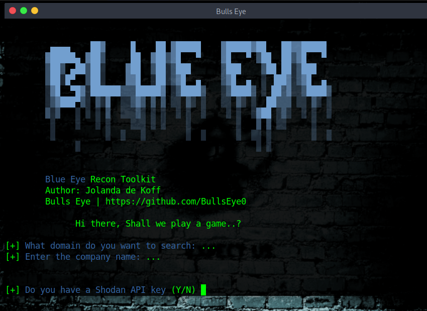

# Blue Eye
Blue Eye is a python Recon Toolkit script. It shows subdomain resolves to the IP addresses, company email addresses and much more ..!

To run Blue Eye, all it takes is a domain and company name when prompted.

## Blue Eye shows the:

✓ Subdomain resolves to the IP addresses
✓ Ports
✓ HTTP Header
✓ Mail Servers
✓ DNS Text Records
✓ Nameserver Records
✓ Sites of interest "email, okta, webmail and slack"
✓ List of GitHub user pages
✓ List of possible company email addresses harvested from GitHub user pages and from DuckDuckGo and Linkedin searches

## Video Blue Eye on YouTube:

https://youtu.be/gWhK_iryM64

## Install Blue Eye on Linux:

git clone https://github.com/BullsEye0/blue_eye.git

cd blue_eye

pip3 install -r requirements.txt

## Use:
python3 blue_eye.py

Have fun ..! 😃

# Contact to coder
Social Networks - Connect

* Website [HackingPassion.com](https://hackingpassion.com)

* [Facebook Personal](https://www.facebook.com/jolandadekoff)

* [linkedin](https://www.linkedin.com/in/jolandadekoff/)

* [Youtube](https://youtu.be/XCtWM-4ov2U)

* [Facebook Page](https://www.facebook.com/ethical.hack.group)

* [Facebook Group](https://www.facebook.com/groups/hack.passion/)

## Buy me a coffee
I have developed Blue Eye because I am passionate about this. 
Donations are one of the many ways to support what I do.

