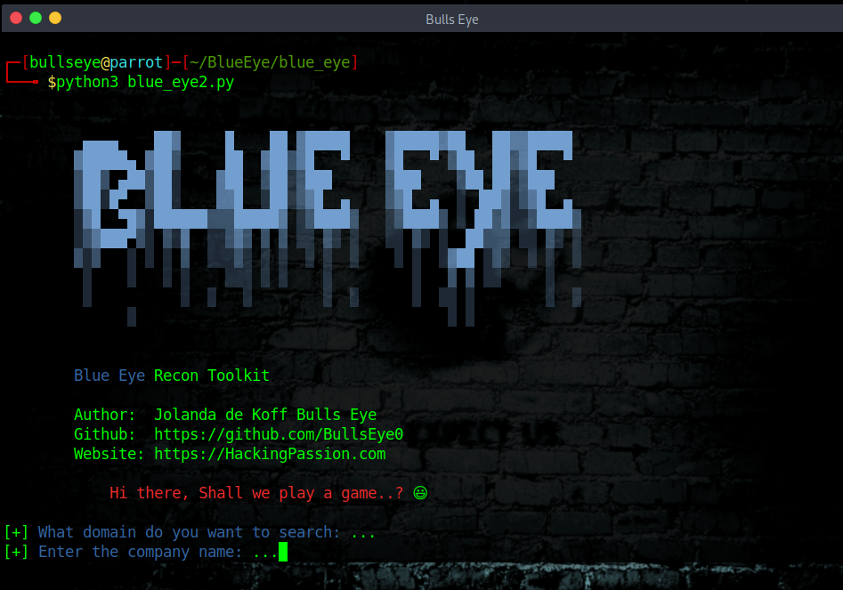
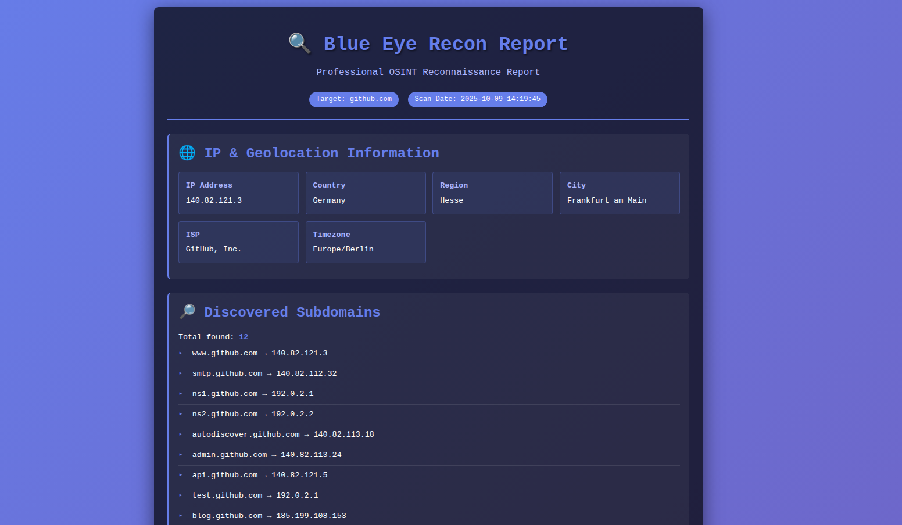
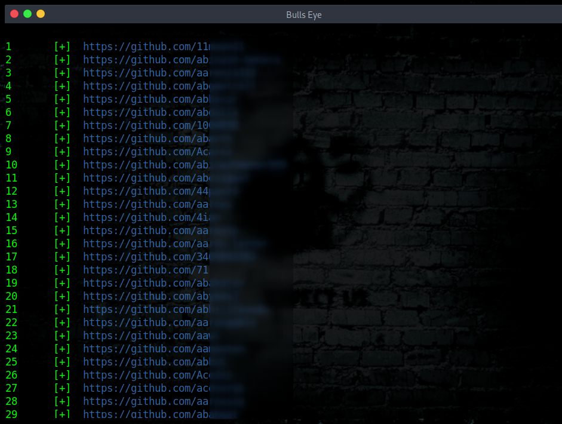

# Blue Eye
Blue Eye is a Python Recon Toolkit script. It shows subdomain resolves to IP addresses, company email addresses, technology stacks, and generates beautiful HTML reports — all in one scan!

To run Blue Eye, all it takes is a domain and company name when prompted.

****

**Here is an article I wrote about Blue Eye:**
https://hackingpassion.com/blue-eye-a-python-recon-toolkit/

****

## Blue Eye shows you:

✓ IP Geolocation & ISP information  
✓ Subdomain discovery (50+ common subdomains)  
✓ Technology stack detection (frameworks, CMS, web servers)  
✓ Open ports scanning  
✓ HTTP Header analysis  
✓ Mail Servers (MX records)  
✓ DNS Text Records  
✓ Nameserver Records  
✓ Certificate Transparency logs  
✓ GitHub user pages discovery  
✓ Company email addresses (from GitHub & DuckDuckGo)  
✓ Professional HTML report generation 📄  

****



****

## 🎯 What's New in v2.1 Extended

**Three powerful new features:**

🔍 **Subdomain Scanner** — Automatically discovers subdomains like admin, api, dev, staging, and more  
🛠️ **Technology Detection** — Identifies web servers, frameworks, CMS, and CDN services  
📄 **HTML Report Generator** — Creates beautiful, professional reports you can share or save  

****

## 📊 Professional HTML Report

Blue Eye automatically generates beautiful, professional HTML reports with all your reconnaissance data:



The report includes everything discovered during the scan — ready to share or save! 🎯

****

## Installation Steps:

1. **Clone the repository:**
```bash
git clone https://github.com/BullsEye0/blue_eye.git
cd blue_eye
```

2. **Create a virtual environment (recommended):**
```bash
python3 -m venv venv
source venv/bin/activate  # On Windows: venv\Scripts\activate
```

3. **Install dependencies:**
```bash
pip3 install -r requirements.txt
```

4. **Install system requirements:**
```bash
# For Debian/Ubuntu/Kali/Parrot:
sudo apt install nmap httpie

# For Arch:
sudo pacman -S nmap httpie
```

****

## How to use Blue Eye:

```bash
python3 blue_eye.py
```

Enter your target domain and company name when prompted, and Blue Eye will gather all the intelligence for you!

After the scan completes, you'll get a beautiful HTML report that you can open in your browser. 🌐

Have fun ..! 😃

****



****

## I also want to make you aware that:
* This was written for educational purposes and pentest only.
* The author will not be responsible for any damage ..!
* The author of this tool is not responsible for any misuse of the information.
* You will not misuse the information to gain unauthorized access.
* This information shall only be used to expand knowledge and not to cause malicious or damaging attacks.
* Performing any hacks without written permission is illegal ..!

****

# Contact with the coder
Social Networks - Connect

* Website [HackingPassion.com](https://hackingpassion.com)

* [Facebook Personal](https://www.facebook.com/profile.php?id=100069546190609)

* [linkedin](https://www.linkedin.com/in/jolandadekoff/)

* [Youtube](https://www.youtube.com/@HackingPassion)

* [Facebook Page](https://www.facebook.com/ethical.hack.group)

* [Facebook Group](https://www.facebook.com/groups/ethical.hack.group/)


***

## 💻 Support this project

If you find this tool useful, consider supporting my work:  
[❤️ Sponsor BullsEye](https://github.com/sponsors/BullsEye0)

Get the full hands-on course:  
**[Ethical Hacking Complete Course – Zero to Expert](https://www.udemy.com/course/ethical-hacking-complete-course-zero-to-expert/?couponCode=BULLSEYE)**

(supports me directly as your instructor!)

Professional penetration testing. Zero to Expert.  
✅ Kali Linux + Parrot OS  
✅ Real-world hacking scenarios  
✅ All major tools & techniques  
✅ Beginner-friendly  

HACKING IS NOT A HOBBY, BUT A WAY OF LIFE 🎯

***

## Donate

I have developed Blue Eye because I am passionate about this. 
Donations are one of the many ways to support what I do.

[Donate](https://hackingpassion.com/donate/)

BAT: Use [Brave](https://brave.com/bul891) and donate on any of my web pages/profiles

[](https://www.paypal.com/cgi-bin/webscr?cmd=_s-xclick&hosted_button_id=R96YN2PUS8V8W)
